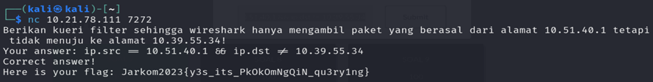

# Jarkom-Modul-1-B01-2023

| Name           | NRP        | Kelas     |
| ---            | ---        | ----------|
| Rr. Diajeng Alfisyahrinnisa Anandha | 5025211147 | Jaringan Komputer (B) |

## Soal No 1

### Soal:
User melakukan berbagai aktivitas dengan menggunakan protokol FTP. Salah satunya adalah mengunggah suatu file.  
<br>
a. Berapakah sequence number (raw) pada packet yang menunjukkan aktivitas tersebut? </br>
<br>
b. Berapakah acknowledge number (raw) pada packet yang menunjukkan aktivitas tersebut? </br>
<br>
c. Berapakah sequence number (raw) pada packet yang menunjukkan response dari aktivitas tersebut?</br>
<br>
d. Berapakah acknowledge number (raw) pada packet yang menunjukkan response dari aktivitas tersebut?</br>

### Jawaban:
- Kita cari terlebih dahulu paket mana saja yang menggunakan protokol `FTP`. Hal ini dapat kita lakukan dengan memasukkan syntax `FTP` di filter wireshark

    
- Karena kita ingin melihat aktivitas protocol `FTP`, maka kita liat dulu perintah `STOR` yang terdapat di frame number 147. 
- Kita klik baris number 147, lalu kita klik kanan untuk melihat TCP Stream. Setelah itu, kita bisa melihat sequence number (raw) dan acknowledgment number (raw)
    <br></br>
    <br></br>

    > Disini, kita dapatkan `sequence number (raw) = 258040667` dan `acknowledgment number (raw) = 1044861039`

- Lalu untuk melihat packet response, kita lihat pada packet number 149. Disitu, terdapat info `Response`
    

- Lalu, kita klik kanan packet nomor 149 tersebut untuk melihat sequence number (raw) dan acknowledgment number (raw)
    <br></br>
    <br>

    > Kita dapatkan `sequence number (raw) = 1044861039` dan `acknowledgment number (raw) = 258040696`

- Maka kita masukkan hasilnya, sehingga:
    <br></br>
    <br></br>

## Soal No 2
### Soal:
Sebutkan web server yang digunakan pada portal praktikum Jaringan Komputer!

### Jawaban:

- Untuk portal praktikum jaringan komputer, tentunya memakai protokol http, karena kita mengakses ke suatu halaman web

- Kemudian, kita filter di wireshark untuk hanya mengeluarkan paket dengan protokol `http`
    

- Lalu, kita lakukan `http stream` 
    
    > Disini, kita ketahui bahwa server yang digunakan adalah `gunicorn`

- Maka kita masukkan hasilnya, sehingga:
    <br></br>
    <br></br>
    

## Soal No 3
### Soal:
Dapin sedang belajar analisis jaringan. Bantulah Dapin untuk mengerjakan soal berikut:  
<br>
a. Berapa banyak paket yang tercapture dengan IP source maupun destination address adalah 239.255.255.250 dengan port 3702?</br>
<br>
b. Protokol layer transport apa yang digunakan? </br>

### Jawaban:
- Untuk mendapatkan banyak paket dengan ip source dan ip destination 239.255.255.250 dengan port 3702, dapat menggunakan syntax:
    `(ip.src == 239.255.255.250 || ip.dst == 239.255.255.250) && udp.port == 3702`

    <br></br>
    > Disini, kita hitung bahwa terdapat 21 paket yang sesuai. Protokol layer yang digunakan juga `UDP`
    

- Maka kita masukkan hasilnya, sehingga:
    <br></br>
    <br></br>

## Soal No 4
### Soal:
Berapa nilai checksum yang didapat dari header pada paket nomor 130?   
### Jawaban: 

- Untuk mendapatkan paket nomor 130, Kita gunakan syntax filter:
    `frame.number == 130`
    

- Untuk mendapatkan nilai checksum, kita klik 2 kali  
paket 130 tersebut lalu kita checksum
    
    > Nilai checksum yang didapat yaitu `0x18e5`

- Maka kita masukkan hasilnya, sehingga:
    <br></br>
    <br></br>


## Soal No 5
### Soal:
Elshe menemukan suatu file packet capture yang menarik. Bantulah Elshe untuk menganalisis file packet capture tersebut.  
<br>
a. Berapa banyak packet yang berhasil di capture dari file pcap tersebut? </br>
<br>
b. Port berapakah pada server yang digunakan untuk service SMTP? </br>
<br>
c. Dari semua alamat IP yang tercapture, IP berapakah yang merupakan public IP? </br>

### Jawaban: 

- Untuk mendapatkan `nc` yang sesuai, kita harus mencari password untuk unzip. Kita bisa mencarinya di file pcap dengan filter `smtp`
    

- Kita klik kanan packet tersebut, lalu kita lakukan `tcp stream` dan cari password:
    
    > Disini, kita dapatkan suatu password dan harus kita decode dengan Base64.

- Kita decode password tersebut
    
    > Disini, kita dapatkan passwordnya yang telah di decode adalah `5implePas5word`

- Password yang telah kita dapatkan, kita gunakan untuk unzip file
    

- Setelah unzip, file txt tersebut berisi instance untuk menjawab pertanyaan. 
    

- Setelah itu, kita dapat menjawab pertanyaan
    <br></br>
    <br></br>

- Lalu kita menjawab soal b
    <br></br>
    <br></br>

- Lalu kita menjawab soal c
    <br></br>
    <br></br>

    > Disini, kita dapat mengetahui bahwa ip public merupakan `74.53.140.153` karena untuk ip dari local jaringan yang digunakan yaitu `10.10.1.4`

- Maka kita masukkan hasilnya, sehingga:
    <br></br>
    <br></br>

## Soal No 6
### Soal:
Seorang anak bernama Udin Berteman dengan SlameT yang merupakan seorang penggemar film detektif. sebagai teman yang baik, Ia selalu mengajak slamet untuk bermain valoranT bersama. suatu malam, terjadi sebuah hal yang tak terdUga. ketika udin mereka membuka game tersebut, laptop udin menunjukkan sebuah field text dan Sebuah kode Invalid bertuliskan "server SOURCE ADDRESS 7812 is invalid". ketika ditelusuri di google, hasil pencarian hanya menampilkan a1 e5 u21. jiwa detektif slamet pun bergejolak. bantulah udin dan slamet untuk menemukan solusi kode error tersebut.

### Jawaban:

-  Pertama, kita cari dulu frame number 7812 dengan syntax `frame.number == 7812`

    
    > Disini, kita dapatkan ip sourcenya yaitu `104.18.14.101`

- Lalu, dari soal, kita dapatkan clue untuk "SUBSTITUSI" dan kita dapatkan clue a1 e5 u23, yang berarti:
    ```
    a = 1
    b = 2
    c = 3
    d = 4
    e = 5
    ...
    u = 21
    v = 22
    x = 24
    y = 25
    z = 26
    ```

- Lalu, dari ip source 104.18.14.101 kita dapat lakukan substitusi agar dapat diubah menjadi huruf, yaitu
    ```
    10 4 18 14 10 1
    10 = j
    4 = d
    18 = r
    14 = n
    10 = j
    1 = a
    ```

    > Maka, jawabannya adalah `jdrnja` atau `JDRNJA`

- Maka kita masukkan hasilnya, sehingga:
    <br></br>
    <br></br>


## Soal No 7
### Soal:
Berapa jumlah packet yang menuju IP 184.87.193.88?

### Jawaban: 

- Untuk mendapatkan packet yang menuju ip 184.87.193.88, kita dapat gunakan syntax
    <br>`ip.dst == 184.87.193.88`</br>
    <br></br>

    > Disini, kita dapat hitung bahwa total packetnya yaitu `6`

- Maka kita masukkan hasilnya, sehingga:
    <br></br>
    <br></br>


## Soal No 8
### Soal:
Berikan kueri filter sehingga wireshark hanya mengambil semua protokol paket yang menuju port 80! (Jika terdapat lebih dari 1 port, maka urutkan sesuai dengan abjad)

### Jawaban: 

- Untuk mengambil semua protokol paket yang menuju port 80, kita dapat menggunakan syntax:
    `tcp.dstport == 80 || udp.dstport == 80`

- Maka kita masukkan hasilnya, sehingga:
    <br></br>
    <br></br>

## Soal No 9
### Soal:
Berikan kueri filter sehingga wireshark hanya mengambil paket yang berasal dari alamat 10.51.40.1 tetapi tidak menuju ke alamat 10.39.55.34!

### Jawaban: 

- Untuk mendapatkan paket yang berasal dari alamat 10.51.40.1 tetapi tidak menuju alamat 10.39.55.34 dapat menggunakan syntax:
    `ip.src == 10.51.40.1 && ip.dst != 10.39.55.34`

- Maka kita masukkan hasilnya, sehingga:
    <br></br>
    <br></br>

## Soal No 10
### Soal:
Sebutkan kredensial yang benar ketika user mencoba login menggunakan Telnet

### Jawaban: 

- Untuk mendapatkan paket dengan protokol telnet, kita dapat mencari port 23, karena telnet menggunakan port 23. Sehingga syntaxnya:
    <br>`tcp.port == 23`</br>
    <br></br>

- Lalu, kita pilih salah satu packet yang menggunakan `tcp` dan kita lakukan `tcp stream`. Disini, kita dapatkan data login dan password:

    

    > Sehingga, kita dapatkan data:  
    login: dhafin  
    password: kesayangannyak0k0

- Maka kita masukkan hasilnya, sehingga:
    <br></br>
    <br></br>